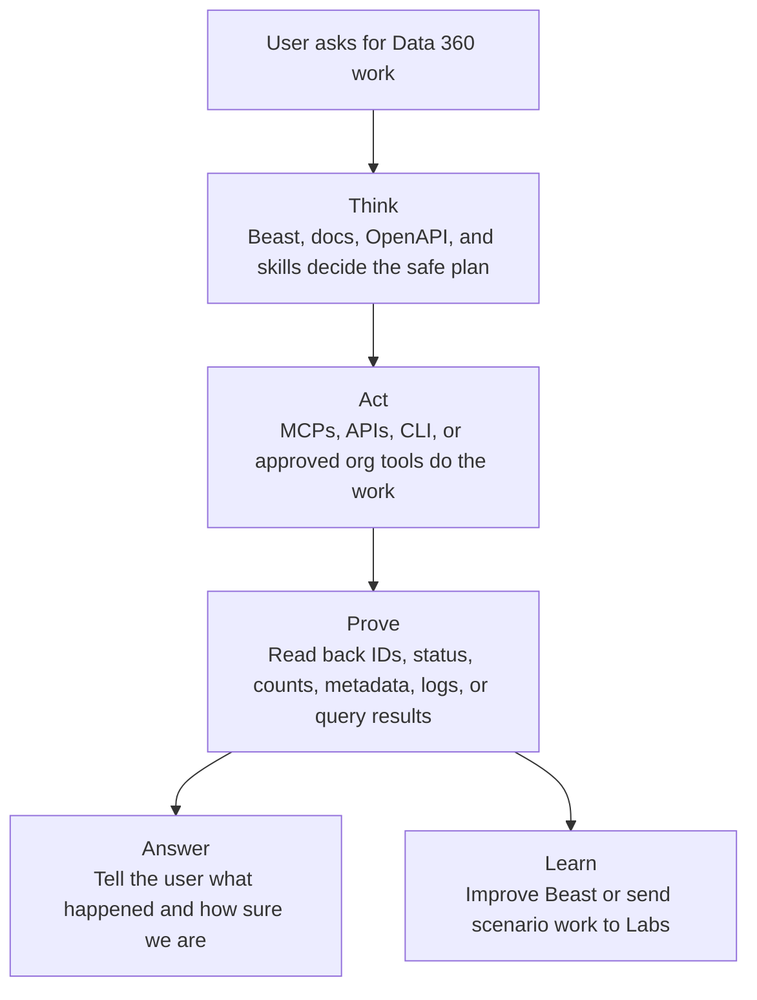

# Operating Model

Data360 Beast is not only a knowledge system. It is an execution system rooted
in proven knowledge with proof and learning loops.

Every non-trivial skill outcome should be execution-ready for the target org,
not just advice. The execution promise is:

```text
Execute in any authorized, compatible Data 360 org after preflight confirms
org, data space, permissions, available tools, and mutation approval.
```

Use this operating loop:

```text
Think -> Act -> Prove -> Learn
```

## Plain-English Architecture



## Think

Use thinking sources before acting:

- Beast preflight for org, API version, data space, persona, lifecycle,
  authorization boundary, available tools, and proof target.
- Phase proof matrix for routing, required sources, proof targets, and forbidden
  assumptions.
- `sf-docs` for current official Salesforce setup, permissions, limits,
  licensing, billing, and behavior.
- OpenAPI or Swagger for exact API method, path, parameters, request body, and
  response shape.
- Beast specialist skills for phase-specific design, caveats, and validation
  habits.
- Salesforce `sf-skills` Data 360 companion for `sf data360` command planning,
  readiness checks, templates, and CLI gotchas.

Thinking produces one of these outcomes:

- an execution-ready plan for an authorized compatible org;
- a safe docs-only answer with a confidence label;
- a blocked-with-reason answer when preflight, permissions, tools, or features
  are missing;
- a lab-required answer when the work needs scenario proof before promotion.

## Act

Act only after the preflight and mutation boundary are clear.

Use action tools for the work itself:

- `data360` MCP for broad live Data 360 Connect API operations.
- `datacloud-mcp-query` for retrieve-plane SQL, table listing, and table
  description.
- Direct `sf` REST calls for exact live API readback when needed.
- `sf data360` CLI workflows when the Salesforce `sf-skills` companion gives
  the right command path.
- Metadata, deployment, or local helper scripts when the phase requires them.

If live validation or mutation is not authorized, stop at an execution-ready
plan and label live validation as unavailable.

## Prove

Do not treat a successful command as proof for the whole outcome. Proof must
match the phase and surface.

Use readback signals such as:

- returned ID;
- status or run state;
- count;
- data space;
- metadata;
- query result;
- destination or event delivery signal;
- log, failure response, or monitor output.

Then label confidence as documented, tested, or inferred.

## Learn

When execution teaches something reusable, promote only the distilled,
public-safe lesson:

- update the proof ledger for tested caveats and readback patterns;
- update specialist skills or docs when a rule becomes durable;
- send scenario-heavy journey design, request/response experiments, traces, and
  failure work to Beast Labs first;
- keep credentials, org metadata, customer data, and raw experiment artifacts
  out of the core repo.

## Detailed Loop

1. Think: run Beast preflight.
2. Think: classify the phase with the proof matrix.
3. Think: identify the object layer and likely execution plane.
4. Think: fetch official docs on demand when facts can drift.
5. Think: search OpenAPI for exact API shape.
6. Think: use Beast specialists and optional Salesforce `sf-skills` companion to
   prepare the execution path.
7. Act: run MCP, API, CLI, metadata, or helper operations only within the
   authorization boundary.
8. Prove: validate with phase-specific readback.
9. Prove: run cost/usage sizing when the design affects material volume,
   cadence, AI/RAG processing, activation delivery, or environment replay.
10. Answer: report done/proven, done/waiting, blocked, inferred, or lab-required.
11. Learn: promote reusable public-safe lessons into Beast or route scenarios
    to Labs.

## Beast Preflight

Use [`beast-preflight.md`](beast-preflight.md) before non-trivial work. The
preflight makes the agent name the target org or alias, API version, data space,
persona, lifecycle, authorization boundary, available tools, and proof target.

If live validation, fresh official docs, or OpenAPI shape is unavailable, keep
working only when safe and label the answer as `inferred`, `docs-unverified`,
`path/schema-unverified`, or `live-validation-unavailable`.

## Phase Proof Matrix

Use [`phase-proof-matrix.json`](phase-proof-matrix.json) as the deterministic
routing table for:

- specialist skill selection
- required source type
- thinking source and execution tool path
- minimum proof target
- forbidden assumptions

The matrix is the machine-readable contract. The human phase table below is a
quick reference.

Use [`phase-coverage-matrix.json`](phase-coverage-matrix.json) to understand
which phases have strong source/proof/helper coverage and which still need
Beast Labs evidence before promotion.

## Phase Router

| Phase | Use For | Proof |
| --- | --- | --- |
| Connect | Connectors, connections, schemas, refresh | Connection status, connector schema, ingestion proof |
| Prepare | Data streams, DLOs, transforms | Stream status, DLO fields, transform output |
| Harmonize | DMOs, mappings, identity, data graphs | Mapping status, relationship metadata, resolved records |
| Govern | Data spaces, tags, classifications, access | Data space, policy, permission, classification readback |
| Retrieve | Query SQL, Query v2, Profile API | Query result, profile result, metadata result |
| Insight | Calculated and streaming insights | SQL validation, CI status, output DMO fields |
| Semantic | Semantic models and metrics | Model readback, metric result, dimension mapping |
| AI/Search | Search indexes, retrievers, grounding | Index status, retrieval result, citation quality |
| Segment | Segments, DBT segments, counts | Segment status, count, publish status |
| Act | Activations and data actions | Target/action readback, activation status |
| Automation | Events and triggered flows | Event payload, flow run, monitoring signal |
| Develop/Package | API surface, auth, data kits, packageability, deployment | Chosen API surface, auth mode, data kit membership, metadata coverage |

## Layer And Engine Triage

Use the engine-aware architecture map for cross-surface mismatches,
performance work, or ambiguous failures:

- `docs/data360/architecture-engine-map.md`
- `docs/data360/interoperability-decision-map.md`
- `docs/data360/rag-search-index-retriever-playbook.md`

| Phase | Common Object Layer | Likely Plane To Consider | Proof Habit |
| --- | --- | --- | --- |
| Connect | DSO, source schema | connector and ingress | connection status, schema readback |
| Prepare | DSO, DLO | processing and lakehouse write | stream status, DLO row count, transform output |
| Harmonize | DLO, DMO | mapping and model metadata | relationship metadata, mapped field proof |
| Retrieve | DLO, DMO, CIO, graph | query and profile retrieval | query job rows, profile result, metadata |
| Insight | DMO, CIO | query plus materialization | syntax check, run status, `__cio` rows |
| Segment | DMO, CIO | segment compiler and count path | segment status, count, publish status |
| Analytics | DMO, CIO, semantic model | analytics serving and cache | report totals, dashboard refresh, user access |
| Act | segment, DMO, CIO | activation orchestration | target readback, activation status, delivery proof |
| Automation | DMO, CIO, event | orchestration and event delivery | control event, flow run, emitted payload |
| Develop/Package | metadata, data kits, APIs | development and deployment lifecycle | data kit readback, deploy validation, auth proof |

Do not promote an inferred engine guess to a fact. Use the guess to choose the
next validation step.

## Model Gallery Loop

Use `docs/data360/model-gallery-implementation-map.md` when the task involves
DMO choice, model diagrams, relationship design, Data Graph shape, or
agent-facing metadata.

```text
business outcome -> model-gallery subject area -> anchor DMO -> grain -> relationship path -> proof surface
```

Treat the gallery as a design compass, not runtime proof. Resolve exact DMO and
field names through metadata in the target data space before writing SQL,
segments, activations, or graph definitions.

## Interoperability Decision Loop

For external sources and lakehouses, choose the pattern before designing assets:

```text
workload -> freshness need -> governance need -> cost/I/O profile -> access pattern -> integration pattern -> proof path
```

| Pattern | Use For | Proof Habit |
| --- | --- | --- |
| Ingestion | governed canonical core, identity, compliance, operational activation | stream/DLO/DMO status, non-admin governance test |
| Real-time ingestion | sub-second operational decisions | event latency, pipeline health, saturation check |
| Streaming ingestion | minute-level incremental freshness | micro-batch status, freshness sample |
| Batch ingestion | historical or low-velocity datasets | scheduled run status, row reconciliation |
| Live query | freshest federated reads | source pushdown, latency, source policy check |
| Accelerated query | frequent reads with stale-data tolerance | cache interval, refresh status, result comparison |
| File federation | large object-store/open-table workloads | table metadata, partition/pruning probe |
| Hybrid | governed core plus fresh/high-volume edge | proof for both ingested core and federated edge |

## Cost And Usage Loop

Use `docs/data360/cost-usage-sizing-contract.md` when the workload has
meaningful ingestion, query, insight refresh, segmentation, activation, RAG,
AI-model, automation, or multi-environment replay volume.

```text
business outcome -> workload driver -> billable usage family -> telemetry proof -> reduction option
```

The contract is qualitative. Do not turn it into a price quote without current
Salesforce docs, Digital Wallet, contract, or Account Executive proof.

## RAG Retrieval Loop

Use `docs/data360/rag-search-index-retriever-playbook.md` when the task
involves Agentforce Data Libraries, unstructured data, search indexes,
chunking, retrievers, prompt grounding, Flow/Apex retrieval, or RAG debugging.

```text
source content -> ADL/manual setup -> field roles -> chunking -> search type -> retriever -> prompt/action -> evaluation
```

Proof should move through the chain: index DMO/chunk population, retriever output,
prompt resolution, agent action selection, final answer, and non-admin access.

## Source Rules

- Official docs are fetched on demand.
- For limits, use `docs/data360/limits-source-precedence.md`: current Data 360
  Limits and Guidelines first, Data Services Billable Usage Types when current
  docs route there, and Customer Data Platform limits only for explicit legacy
  CDP scope or labeled comparison.
- OpenAPI is used for exact API shape.
- Proof ledger evidence is used for working surfaces, validation readbacks, and
  known caveats.
- `datacloud-mcp-query` is optional for retrieve-plane Query SQL, table listing,
  and table description. It does not replace `data360` MCP for broad Connect
  API operations.
- Labs remains the home for golden scenarios, synthetic journeys, raw payload
  experiments, traces, and future cookbook candidates.
- Live org validation upgrades confidence from documented to tested.

## Confidence Labels

- `Documented`: supported by current official docs or OpenAPI.
- `Tested`: validated in a live authorized org.
- `Inferred`: reasonable but not yet proven in the target org.
